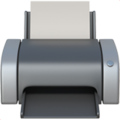
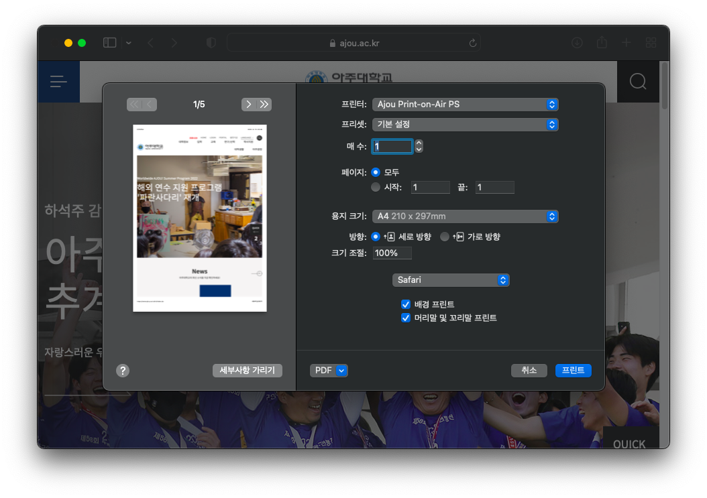
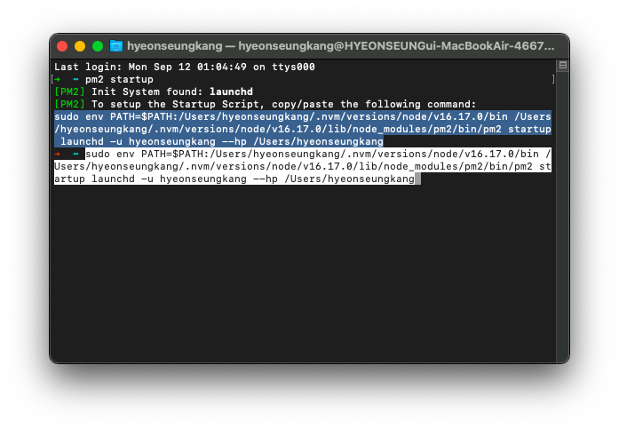
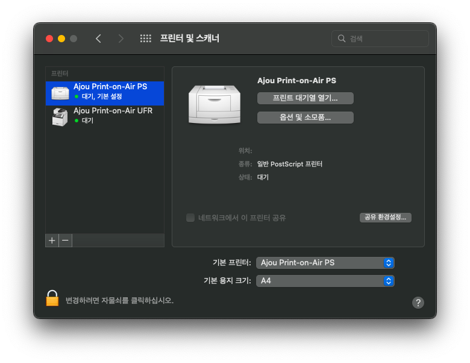
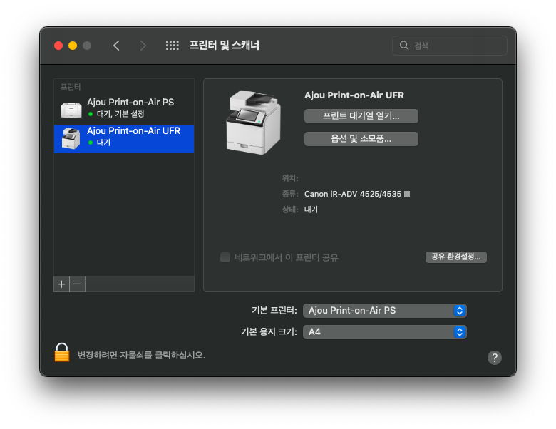
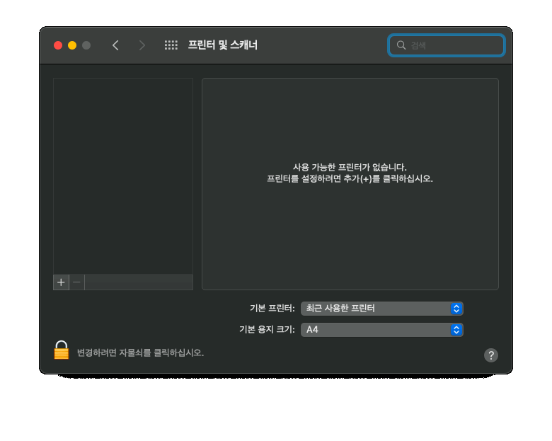

# Ajou Print-on-Air

## 목차

- [프로젝트 설명](#intro)
- [사용 방법](#how-to-use)
- [설치 단계](#how-to-install)
  - [단계 1. 드라이버 설치](#install-driver)
  - [단계 2. 종속성 설치 및 env 파일 설정](#install-dependencies)
    - [방법 1. 쉬운 설치](#easy-install)
    - [방법 2. 수동 설치](#manual-install)
  - [단계 3. 자동시작 설정](#set-auto-launch)
  - [단계 4. 프린터 추가](#add-printer-setting)
    - [단계 4.1. Ajou Print-on-Air PS 설정 방법](#ps-ipp-add)
    - [단계 4.2. Ajou Print-on-Air UFR 설정 방법](#ufr-ipp-add)

<a id="intro" />

## 프로젝트 설명

`Ajou Print-on-Air`는 맥 환경에서 아주대학교 내 공용프린터를 사용할 수 있도록 합니다.

<a id="how-to-use" />

## 사용 방법

프린터로 `Ajou Print-on-Air PS`를 선택하여 인쇄하면 됩니다. 
프린터로 `Ajou Print-on-Air UFR` 선택 시 인쇄물이 무시됩니다.

<a id="how-to-install" />

## 설치 단계

<a id="install-driver" />

### 단계 1. 드라이버 설치

아래 맥용 캐논 UFR II 드라이버를 설치하세요.

[Canon UFR II Driver-Mac](https://asia.canon/en/support/0101135101?model=3327C006)

<a id="install-dependencies" />

### 단계 2. 종속성 설치 및 env 파일 설정

<a id="easy-install" />

#### 방법 1. 쉬운 설치

아래 명령어를 터미널에 붙여 넣고 실행하세요. 
비밀번호를 묻는 경우 유저 비밀번호를 입력하면 됩니다. 
비밀번호 입력의 경우 homebrew 설치 과정이 요구하는 것입니다. 
설치 중 오류가 발생할 경우 터미널 창을 닫은 후 다시 열어 실행하셔도 됩니다.

~~~
/bin/bash -c "$(curl -fsSL https://raw.githubusercontent.com/khskeb0513/ajou-print-on-air/master/install.sh)"
~~~

<a id="manual-install" />

#### 방법 2. 수동 설치

node.js와 ghostscript는 필수로 설치하여야 합니다. 
Homebrew, pm2, git는 선택하여 설치할 수 있습니다. 그러나 복잡할 수 있습니다. 
env 파일 설정은 필수 단계입니다.

~~~
# git 설치
git

# homebrew 설치
/bin/bash -c "$(curl -fsSL https://raw.githubusercontent.com/Homebrew/install/HEAD/install.sh)"

# node and ghostscript 설치
# Homebrew가 없다면 아래 종속성을 수동으로 설치할 수 있습니다.
brew install node ghostscript

# pm2 설치
# pm2는 백그라운드 동작을 위해 사용합니다.
npm install -g pm2

# 프로젝트 복제
# Git이 없다면 프로젝트 전체를 다운로드 받아 사용할 수 있습니다.
git clone https://github.com/khskeb0513/ajou-print-on-air

# env 파일 설정 
# env.yml 파일은 유저 이름을 저장하기 위해 사용합니다.
cd ajou-print-on-air
touch env.yml
echo ""
echo -n "Phone number: " && read NICKNAME
echo "nickname: '$NICKNAME'" > env.yml

# 프로젝트 시작
pm2 start
~~~

<a id="set-auto-launch" />

### 단계 3. 자동시작 설정

아래 명령어를 터미널 창에 붙여 넣고 실행하세요.
~~~
pm2 startup
~~~

선택한 부분을 드래그하여 복사한 후 터미널 창에 다시 붙혀 넣어 실행하세요.
비밀번호를 묻는 경우 유저 비밀번호를 입력하면 됩니다.
비밀번호 입력의 경우 컴퓨터가 켜지면서 함께 시작되도록 설정하기 위해서입니다.

다시 터미널 창에 아래 명령어를 붙여 넣고 실행하여 프로젝트가 자동실행 되도록 설정합니다.
~~~
pm2 save
~~~

<a id="add-printer-setting" />

### 단계 4. 프린터 추가

`Ajou Print-on-Air PS`와 `Ajou Print-on-Air UFR` 모두 설정하여야 합니다. 
둘 간의 설정 순서는 상관 없습니다. 
최종적으로 아래의 사진과 같이 설정되어야 합니다.
<table><tr><td></td><td></td></tr></table>

<a id="ps-ipp-add" />

#### 단계 4.1. Ajou Print-on-Air PS 설정 방법

1. (+)버튼을 눌러 프린터 추가 창을 엽니다.
2. `Ajou Print-on-Air PS`를 선택합니다.
3. `프린터 정보 수집 중...`이라는 글자가 사라지면 `일반 PostScript 프린터`가 자동으로 선택됩니다. PS의 경우 이를 변경하지 말아야 합니다.
4. (추가)버튼을 누른 후, `양면 프린트 장비`의 체크박스가 해제되어 있음을 확인힙니다.
5. (확인)버튼을 눌러 설정을 마칩니다.

<a id="ufr-ipp-add" />

#### 단계 4.2. Ajou Print-on-Air UFR 설정 방법

1. (+)버튼을 눌러 프린터 추가 창을 엽니다.
2. `Ajou Print-on-Air UFR`을 선택합니다.
3. `프린터 정보 수집 중...`이라는 글자가 사라지면 `일반 PostScript 프린터`가 자동으로 선택됩니다. UFR의 경우 이를 변경하여야 합니다.
4. `일반 PostScript 프린터`를 클릭한 후, `소프트웨어 선택...`을 선택하여 프린터 소프트웨어 창을 엽니다.
5. 필터에서 '4525'를 입력한 후, `Canon iR-ADV 4525/4535 III`를 선택한 후 (확인)버튼을 누릅니다.
6. 사용 란에 `Canon iR-ADV 4525/4535 III`이 선택되었음을 확인하고 (추가)버튼을 눌러 설정을 마칩니다.

<table><tr><td></td><td></td></tr></table>
